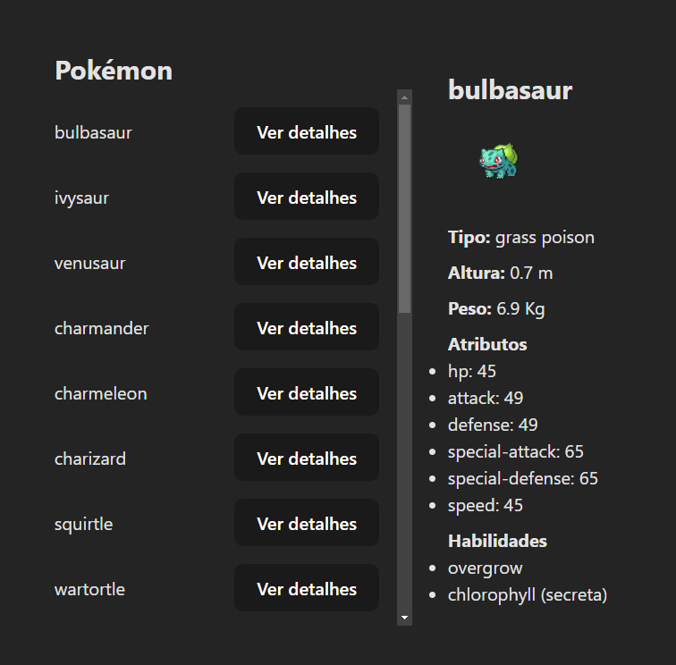

# Pokemon Api

Pokemon Api é uma aplicação web desenvolvida com React que consome a API de Pokémon e exibe os dados dos Pokémon para o usuário. Este projeto foi criado para estudar o consumo de APIs usando fetch, useState e useEffect no React.

## Demonstração



## Funcionalidades

- 🐾 Lista de Pokémon com opção para ver detalhes
- 🔍 Exibição de detalhes do Pokémon selecionado, incluindo:
  - Imagem
  - Tipos
  - Altura
  - Peso
  - Atributos
  - Habilidades

## Tecnologias Utilizadas

- React

## Como Executar o Projeto

1. Clone o repositório:

    ```bash
    git clone https://github.com/mdanieldantas/pokemon-api.git
    cd pokemon-api
    ```

2. Instale as dependências:

    ```bash
    npm install
    ```

3. Execute o projeto:

    ```bash
    npm start
    ```

4. Abra [http://localhost:3000](http://localhost:3000) no seu navegador para ver a aplicação em execução.

## Aprendizados

Este projeto foi uma excelente oportunidade para:

- 📚 Aprender e praticar React com hooks como useState e useEffect
- ⚙️ Consumir APIs utilizando a função fetch
- 🎨 Criar uma interface de usuário intuitiva e responsiva


## Contribuições

Contribuições são bem-vindas! Sinta-se à vontade para abrir uma issue ou enviar um pull request.

## Licença

Este projeto está sob a licença MIT. Veja o arquivo LICENSE para mais detalhes.

## Contato

**M Daniel Dantas**

- **GitHub:** [mdanieldantas](https://github.com/mdanieldantas)
- **LinkedIn:** [mdanieldantas](https://www.linkedin.com/in/mdanieldantas)
- **Portfólio:** [Portfólio de Daniel Dantas](https://danieldantasdev.vercel.app)
- **Email:** [contatomarcosdgomes@gmail.com](mailto:contatomarcosdgomes@gmail.com)
- **Link do Projeto:** [pokemon-api](https://github.com/mdanieldantas/pokemon-api)
- **Currículo:** [Baixar Currículo](https://docs.google.com/document/d/1_FpPYPXiifH1B3BDWnJuNk05DQfddCOBqFxyT6Citg4/edit?usp=sharing)